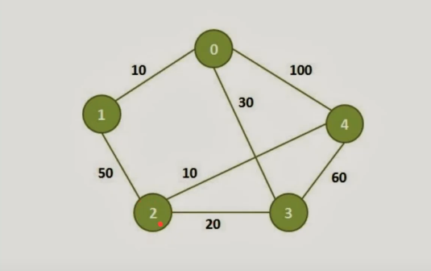

<h3 align="center">Graph implementation using C</h3>
<p align="center">Graph implementation using adjacency matrix</p>

## Weighted graph used on tests



This graph example was used for testing purposes, with inputs stored on `input.txt`.

```sh
# To run this test, use the below command:
make test
```

### Adjacency matrix representation
Non-oriented weighted adjacency matrix representation of the above graph.

| 0   | 1   | 2   | 3   | 4   |
| --- | --- | --- | --- | --- |
| 0   | 10  | 0   | 30  | 100 |
| 10  | 0   | 50  | 0   | 0   |
| 0   | 50  | 0   | 20  | 10  |
| 30  | 0   | 20  | 0   | 60  |
| 100 | 0   | 10  | 60  | 0   |

### Minimum spanning tree (MST)

Data results implemented on Kruskal's algorithm.

**Edges path**:
1. Edges (4, 2) with weight = 10
2. Edges (2, 3) with weight = 20
3. Edges (3, 0) with weight = 30
4. Edges (0, 1) with weight = 10

**Minimum cost**: 70
